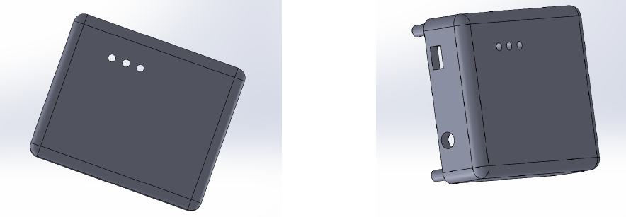

# Analog-Project---EMG-Based-Muscle-Strain-Detector

Our EEG-based Muscle Signal Detector is an innovative device designed to capture and analyze EMG signals to monitor muscle activity effectively. By accurately detecting electrical signals generated by muscle contractions, the system amplifies and filters the signals to ensure precision. The processed data is then used to determine the user's muscle strain level, which is displayed as high, medium, or low thresholds. This device provides an efficient and reliable solution for muscle strain monitoring, making it ideal for applications in rehabilitation, sports science, and biomedical research.

The device captures muscle signals using \textbf{three electrodes} placed on the skin. The weak EMG signals are amplified through an instrumentation amplifier for precision and noise reduction. The amplified signals are then filtered using two Sallen-Key low-pass filters to remove unwanted noise and isolate the relevant frequency range.

The filtered signal is fed into a comparator, which determines the muscle strain level by comparing the signal to predefined thresholds. The output strain levels low, medium, or high are displayed through LED indicators connected to the comparator, providing a clear and immediate visual representation of muscle activity. This streamlined process ensures accurate and real-time monitoring of muscle strain

## Functionality Description

The device captures muscle signals using three electrodes placed on the skin. The weak EMG signals are amplified through an instrumentation amplifier for precision and noise reduction. The amplified signals are then filtered using two Sallen-Key low-pass filters to remove unwanted noise and isolate the relevant frequency range. The filtered signal is fed into a comparator, which determines the muscle strain level by comparing the signal to predefined thresholds. The output strain levels—low, medium, or high—are displayed through LED indicators connected to the comparator, providing a clear and immediate visual representation of muscle activity. This streamlined process ensures accurate and real-time monitoring of muscle strain.

## The circuit

The circuit consisits of each item in the block diagram. More information can be found in the project report including the necessary calculations done. (In the document folder). A complete figure of the schematic diagram is given below

## Printed Circuit Board

PCB is one of the main components in our device. By using a PCB we have integrated all electronic components and reduced noise, improving the integrity of the signal.

To design the PCB we have used Altium Designer software. To achieve design objectives, the majority of components included in this PCB are Surface-Mount Devices (SMD). By doing so, we have reduced the size
of the PCB considerably. Also, to ensure signal stability and to reduce interference, the bottom layer of the PCB has been designed as a ground plane. When considering the current going through the PCB it is less than 100mA. This is because the major components used for this PCB are OPAMPS and LEDs. So, the trace width used was 10mil which is more than enough for the above mentioned current. In addition, the OPAMPS have been placed in the center of the circuit to ensure correct routing. Furthermore, all signal traces are in the top plane to reduce interference. A small amount of power traces have been routed through the bottom plane to reduce the PCB size. To ensure a stable power supply to OPAMPS, 100nF decoupling capacitors have been added to the power supply inputs.

The PCB was fabricated by the renown PCB manufacturer, JLC PCB. The dimensions of the PCB are 76.2 mm*50.3 mm which is quite compact. Also the PCB thickness is 1.6mm with a outer copper weight of 1 oz. The surface finish used is HASL (Hot Air Solder Leveling), which ensures reliable soldering and protects copper traces from oxidation. A white silkscreen was also applied to identify components.

##Enclosure Design

The enclosure is designed with two parts. The top part consist of the part that holds the PCB and the LEDs which acts as the indicators. The bottom part consists of the battery compartment.

[All the test results and simulations are included in the project report]

## Conclusion
The EMG-based Muscle Strain Detector effectively captures, processes, and analyzes muscle signals to provide real-time feedback on strain levels. By utilizing three electrodes, an instrumentation amplifier, Sallen-Key low-pass filters, and a comparator, the device ensures precision, noise reduction, and accurate signal interpretation. The visual output through LED indicators allows users to easily monitor muscle strain in low, medium, or high levels. This system is reliable, cost-effective, and suitable for applications in rehabilitation, sports science, and biomedical research, offering a practical solution for muscle activity monitoring and analysis.
